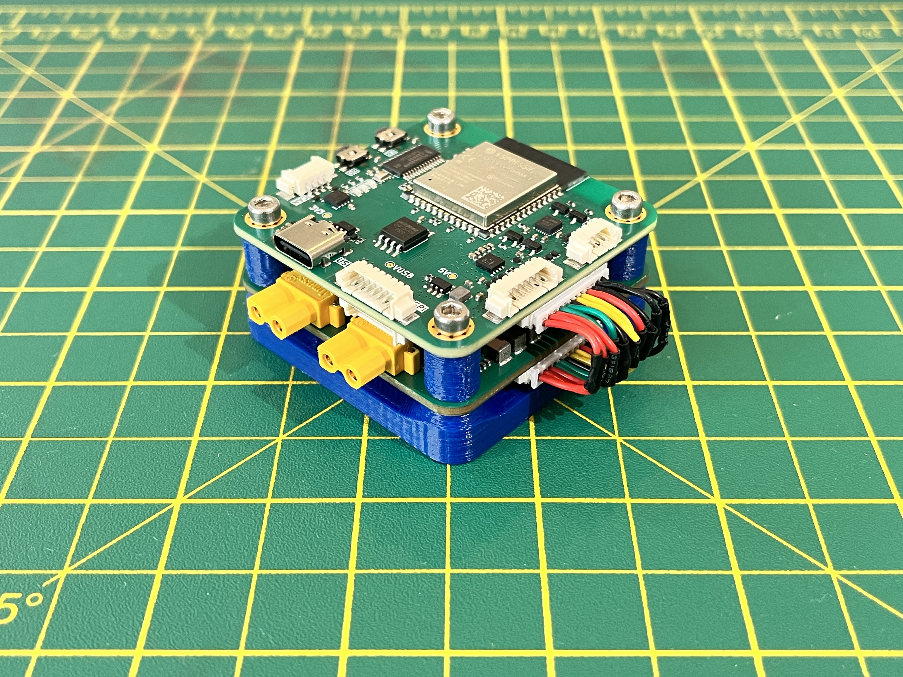

<div align="center">

# AURA
### Autonomous Universal Robotics Architecture



</div>

## Contents

1. [Overview](#overview)  
2. [Repository Structure](#repository-structure)
3. [License](#license)

## Overview

AURA (Autonomous Universal Robotics Architecture) is a modular set of PCBs designed for robotics applications. This repository includes schematics, layouts, and KiCad project files to facilitate prototyping and production.

The software framework to run on this hardware can be seen in another repository [here](https://github.com/alexander-armitage/AURA-Software).


### Features
#### MCU
- Dual Core 240MHz ESP32-S3
- Onboard IMU (ICM20948) 
- Onboard barometer (BMP280)
- Flash storage (128 MBit)
- SD card support
- 1x CAN connector
- 1x I2C connector
- 2x SPI connector
- 2x UART connectors
- 12x PWM output channels
- Power switching
- ESD protection

#### PDB
- 1x Battery pass-through
- 1x 5V 20A continuous output
- 2x high-current (10A) output channels
- 2S-6S LiPo battery input support
- Reverse polarity protection
- Power, Current, and Voltage sensing
- ESD protection

## Repository Structure

```
AURA-Hardware/
├── .github/              # Images for README
├── MCU_AURA/             # ESP32S3 based PCB project
│ ├── Gerber/             # Manufacturing files (JLCPCB)
│ ├── Libraries/          # Local project libraries
| ├── Pick_n_Place/       # Files to generate pick and place (JLCPCB)
│ └── MCU_AURA.kicad_pro  # Project file for KiCad
├── PDB_AURA/             # Power distribution board PCB project
│ ├── Gerber/             # Manufacturing files (JLCPCB)
│ ├── Libraries/          # Local project libraries
| ├── Pick_n_Place/       # Files to generate pick and place (JLCPCB)
│ └── PDB_AURA.kicad_pro  # Project file for KiCad
├── docs/                 # Schematics for the PCB projects
├── .gitignore            # Git ignore file
├── README.md             # Project overview
└── LICENSE               # License file
```

## License
See the [LICENSE](./LICENSE) file for more details.
